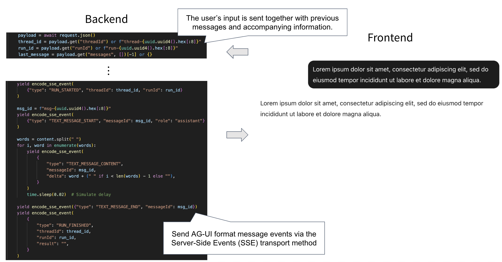
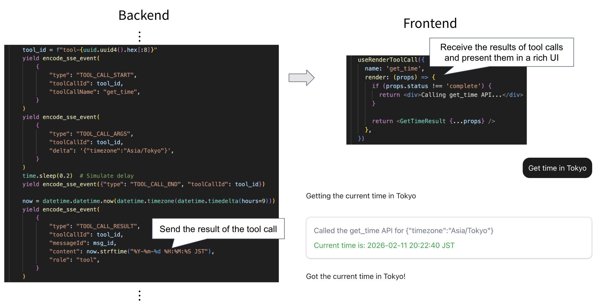
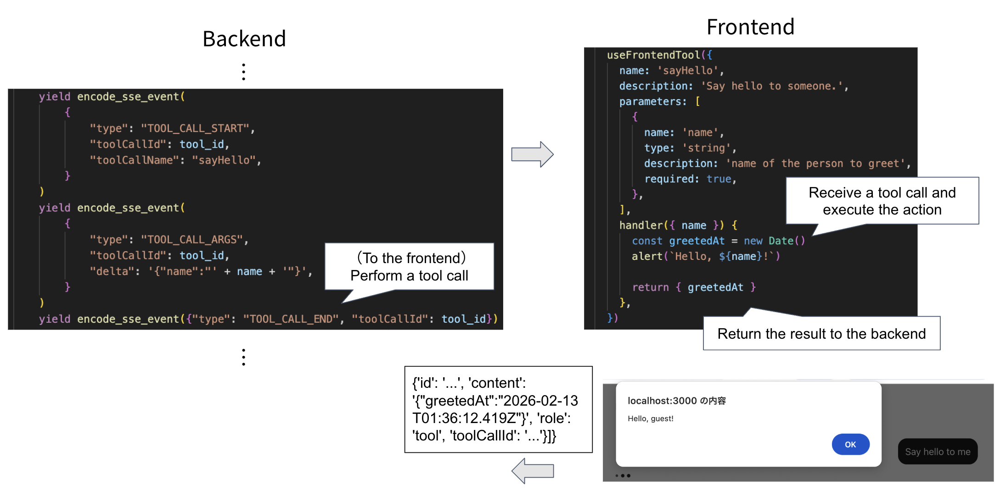
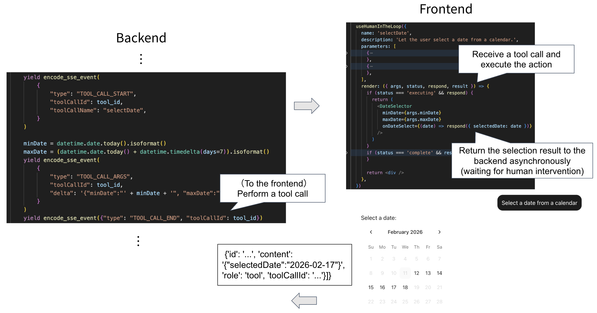
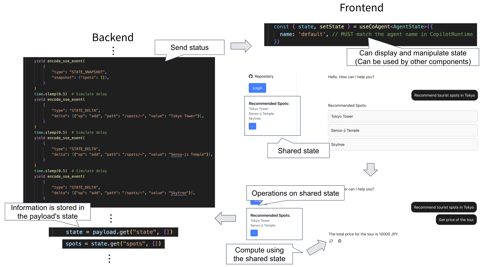
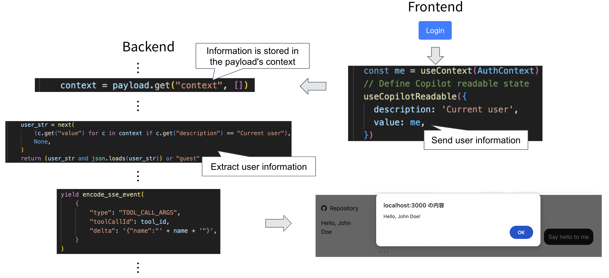

# learn-copilotkit-agui

This repository demonstrates the integration of [CopilotKit](https://www.copilotkit.ai/
) and [AG-UI](https://docs.ag-ui.com/introduction) in a simple project. The backend does not utilize a large language model (LLM); instead, it returns responses based solely on AG-UI logic. The purpose is to help understand the data flow between the backend and frontend.

For detailed setup instructions, please see the README files in each directory:
- Backend: [backend/README.md](backend/README.md)
- Frontend: [frontend/README.md](frontend/README.md)

## Examples

Once you have completed the backend and frontend setup, you can try out the following features.
Press the chat suggest button to send each message.
For backend event handling, see [backend/src/features/agent/router.py](backend/src/features/agent/router.py).

### Send Message

### Rendering of tool call results: [useRenderToolCall](https://docs.copilotkit.ai/reference/hooks/useRenderToolCall)

### Use the frontend as a tool from the agent: [useFrontendTool](https://docs.copilotkit.ai/reference/hooks/useFrontendTool)

### Use the frontend + human intervention as tools: [useHumanInTheLoop](https://docs.copilotkit.ai/reference/hooks/useHumanInTheLoop)

### Render the agent’s state: [useCoAgentStateRender](https://docs.copilotkit.ai/reference/hooks/useCoAgentStateRender)

### Share state between the agent and the front end: [useCoAgent](https://docs.copilotkit.ai/reference/hooks/useCoAgent)

### Send frontend information to the agent: [useCopilotReadable](https://docs.copilotkit.ai/reference/hooks/useCopilotReadable)
